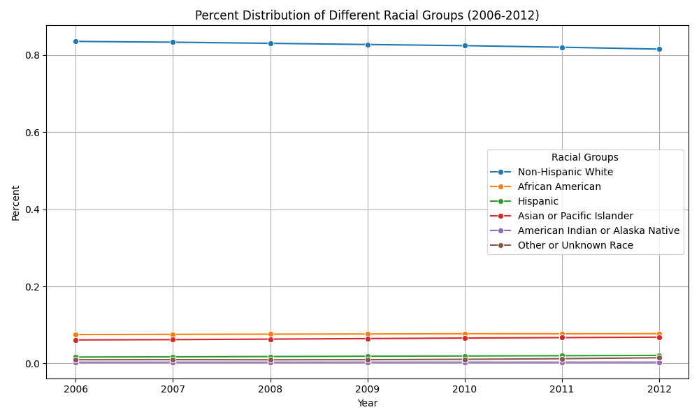

# Medicare-Medicaid-Enrollment-Analysis

## Overview
This project analyzes and visualizes Medicare-Medicaid enrollment statistics by state and the racial distribution of enrollees over time (2006-2012). It leverages data from the **MMLEADS PUF V2.0 (2006-2012)** dataset and presents the results through an interactive **choropleth map** and a **line plot**.

## Features
- **Choropleth Map**: Displays the Medicare-Medicaid enrollment percentage by state using Plotly.
- **Line Plot**: Visualizes the percent distribution of racial groups across different years using Seaborn.
- **Automated Data Processing**: Cleans, transforms, and filters data for accurate analysis.
- **HTML Report**: Combines the two visualizations into a single HTML file for easy viewing.

## Requirements
Ensure you have the following Python libraries installed:
```bash
pip install pandas plotly matplotlib seaborn openpyxl
```

## Usage
**Run the script**:
   ```bash
   python script.py
   ```
   
## Data Processing Steps
1. **Enrollment by State**
   - Extracts state-level enrollment data.
   - Computes percentage of total enrollees per state.
   - Generates a **choropleth map** using Plotly.

2. **Racial Demographics Over Time**
   - Extracts race-based statistics from multiple sheets.
   - Transposes and cleans data for easier visualization.
   - Plots race distribution trends from 2006 to 2012.

## Example Output
### Choropleth Map (Sample Preview)
*Displays enrollment percentages by state using different shades of blue.*

### Line Plot (Sample Preview)
